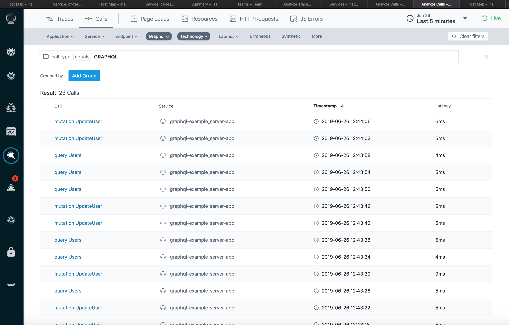
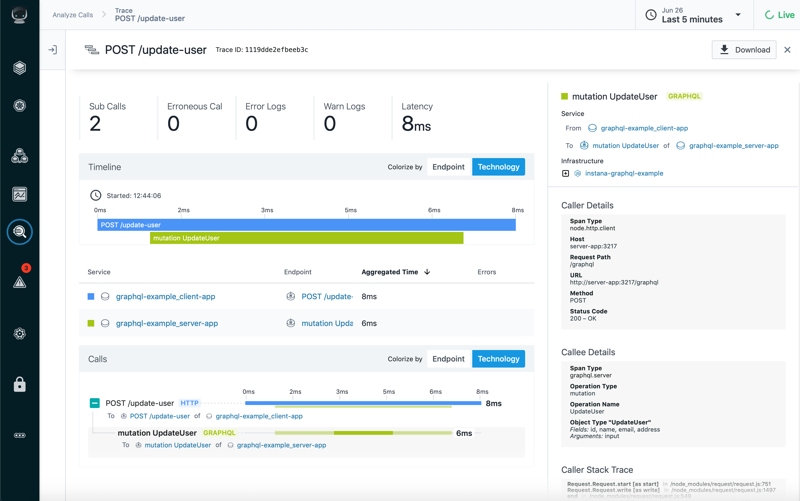
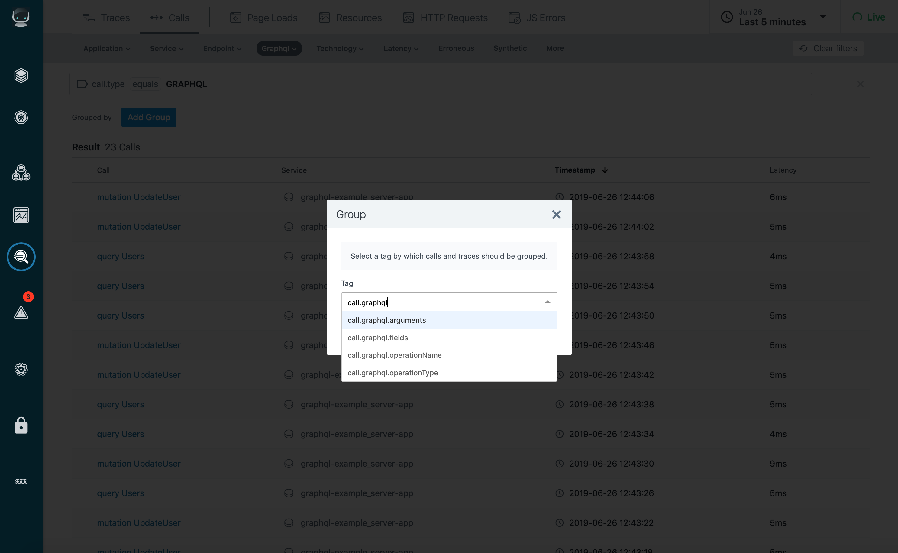

# Instana GraphQL Demo

This repository contains a demo to test Instana's GraphQL support released with version 157.

## Prerequisites

- A `docker-compose` installation running on your machine. This demo has been created and tested on Mac OS X with `docker-compose` and `docker-machine`.
- Access to an Instana tenant v157 or higher.

## Configure

Create a `.env` file in the root of the checked-out version of this repository and enter the following text, with the values adjusted as necessary:

```text
agent_key=<TODO FILL UP>
agent_endpoint=<local ip or remote host; e.g., saas-us-west-2.instana.io>
agent_endpoint_port=<443 already set as default; or 4443 for local>
agent_zone=<name of the zone for the agent; default: graphql-demo>
```

## Build

```bash
docker-compose build
```

## Launch

```bash
docker-compose up
```

This will build and launch:

- A Dockerized Instana agent,
- the `client-app` Node.js application, which issues a GraphQL query or a mutation against the server every four seconds, and
- the `server-app` Node.js application, which provides an Apollo-based GraphQL API.

After the agent is bootstrapped and starts accepting spans from the test applications, the results are visible, for example, in the Analyze view when filtering calls and traces via the new call type `GRAPHQL`:

## GraphiQL/Playground

In addition to the GraphQL operations that are triggered automatically every few seconds, you can also go to <http://localhost:3217/> to access the server's GraphiQL instance. GraphiQL is a graphical interactive in-browser GraphQL IDE. You can use it to explorer the GraphQL schema and execute queries and updates manually. Naturally, these operations are reported to the configured Instana unit, so you can check out how they are displayed in Instana.



Details of the GraphQL queries and mutations are available in the `Call Details` panel of the Trace view, giving insight on:

- What GraphQL operation was executed,
- which arguments were set, and
- which fields of which Object Type were selected.



Based on the data we collect on GraphQL queries and mutations, the Analyze Calls view has a few interesting tricks, like being able to group calls by:

- Operation types,
- operation names,
- object types and their fields, and
- arguments


